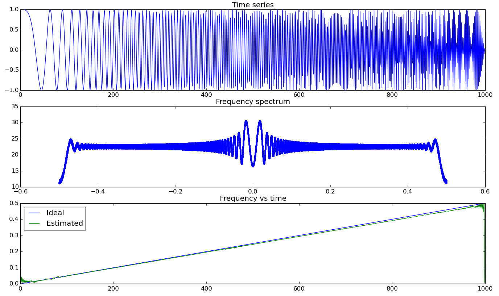

# Amplitude modulated Frequency modulated signal decomposition

This repository contains code and examples for
AM-FM decomposition of 1D (sound) and 2D (image) signals.

Results from amfm1d demo

Results from amfm2d demo

